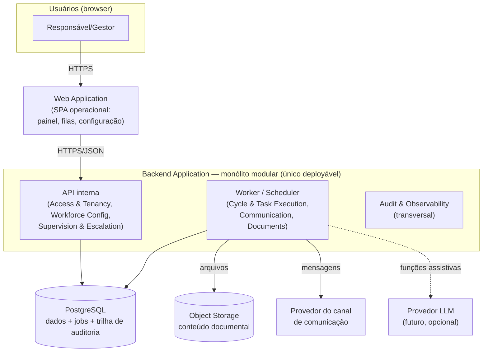

# Container Architecture — Servium IA MVP

> **Fase 003 — Arquitetura do MVP** · Visão inspirada em C4 — nível **Container** (unidades lógicas de software, não Docker). Derivada de [`DOMAIN_BOUNDARIES.md`](DOMAIN_BOUNDARIES.md) e dos drivers ([`ARCHITECTURE_DRIVERS.md`](ARCHITECTURE_DRIVERS.md)).

## Diagrama lógico

## Containers e justificativas

| Container | Responsabilidade | Justificativa de existência |
|---|---|---|
| **Web Application** (SPA) | Interface operacional: painel de status, fila de exceções, aprovações, configuração | FR-011, FR-012, FR-003, FR-004; NFR-013 |
| **Backend Application** — único deployável com módulos internos (B1..B7) | Toda a lógica: API síncrona para humanos + worker/scheduler assíncrono para ciclos, envios, validações e retries | ADRV-011 simplicidade; ADR-001 (monólito modular); módulos = fronteiras lógicas, não processos separados |
| **PostgreSQL** | Dados transacionais, jobs persistidos, trilha de auditoria append-only | ADRV-001/002/005; ADR-004, ADR-006 |
| **Object Storage** | Conteúdo binário dos documentos (metadados no banco) | ADRV-007; ADR-007 |
| *Provedor de canal* (externo) | Entrega/recepção de mensagens | ADR-008 — atrás de porta `CommunicationChannel` |
| *Provedor LLM* (externo, futuro) | Funções assistivas delimitadas | ADR-010 — ausente no piloto se validação indicar |

## Decisões estruturais embutidas

1. **Um único backend deployável** com dois perfis de execução (API e worker/scheduler) — podem rodar como processos separados no mesmo deploy sem virar microsserviços;
2. **Jobs no banco** (ADR-006): o agendador consulta/executa jobs persistidos; recuperação a falha é trivial; nenhuma fila externa no MVP;
3. **SPA + API JSON**: frontend não tem renderização server-side — público interno, SEO irrelevante;
4. **Conteúdo fora do banco**: object storage evita inchar backups e facilita retenção LGPD (ADRV-007).

## O que deliberadamente NÃO existe nesta visão

- Microsserviços, service mesh, message broker dedicado, Kubernetes, múltiplos ambientes complexos, cache distribuído, CDN para app interna. Cada ausência é justificada em [`ARCHITECTURE_REVIEW.md`](ARCHITECTURE_REVIEW.md).
