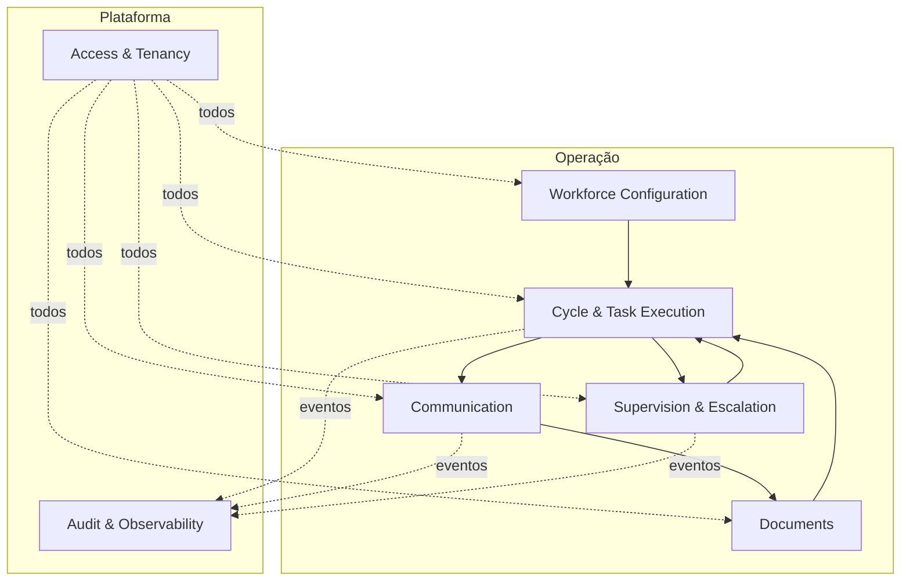

# Domain Boundaries do MVP — Servium IA

> **Fase 003 — Arquitetura do MVP** · Etapa B
> Agrupamentos coerentes de responsabilidades (módulos candidatos dentro do estilo arquitetural proposto em ADR-001). Não é DDD formal nem modelagem física: **nenhuma tabela, schema ou API é definida aqui**.

## Critérios de agrupamento

- **Coesão:** responsabilidades que mudam pelos mesmos motivos ficam juntas;
- **Acoplamento:** dependências direcionadas e mínimas entre módulos;
- **Ownership de dados:** cada dado tem um único módulo dono de escrita;
- **Transações:** operações que exigem consistência forte devem caber dentro de um módulo (ou ter compensação explícita);
- **Evolução futura:** fronteiras que sobrevivem à chegada de novos Funcionários Digitais e funções administrativas multi-tenant.

## Módulos propostos (7)

### B1 — Access & Tenancy

- **Propósito:** identificar quem (humano ou tenant) está agindo e autorizar o acesso.
- **Responsabilidades:** registro de tenants; usuários; autenticação; papéis mínimos (responsável/gestor); contexto de tenant para todas as operações.
- **Dados conceituais:** Tenant, Usuário, Papel/Atribuição.
- **Entradas:** credenciais; operações administrativas de tenant.
- **Saídas:** sessão/contexto autenticado (tenant + usuário + papéis).
- **Dependências:** nenhuma (módulo raiz).
- **Eventos relevantes:** usuário criado/desativado; papel alterado.
- **NÃO pertence aqui:** permissões granulares por funcionalidade de negócio (evolução futura); billing.

### B2 — Workforce Configuration

- **Propósito:** definir o trabalho e seus limites antes da execução — a "contratação" e gestão do Funcionário Digital.
- **Responsabilidades:** checklists por cliente/obrigação; cadastro de clientes e responsáveis designados; templates aprovados; limites de autonomia (`max_attempts`, intervalos, janelas); definição do tipo de Funcionário Digital (configuração declarativa no MVP).
- **Dados conceituais:** Checklist/Item esperado, Cliente, Template, Configuração de autonomia, Definição de Funcionário Digital.
- **Entradas:** ações de configuração do responsável.
- **Saídas:** configuração versionada consumida pela execução.
- **Dependências:** Access & Tenancy.
- **Eventos relevantes:** checklist alterado; template aprovado/desativado; limites alterados.
- **NÃO pertence aqui:** estado corrente de execução; histórico de envios.

### B3 — Cycle & Task Execution

- **Propósito:** orquestrar o trabalho: ciclos, itens, estados, retries e idempotência.
- **Responsabilidades:** ativação de ciclo (gate humano); identificação de pendentes; máquina de estados dos itens; agendamento de cobranças conforme limites; retries técnicos seguros; chaves de idempotência para efeitos externos; fechamento de ciclo com relatório.
- **Dados conceituais:** Ciclo, Item de pendência (+estado), Execução, Agendamento, Chave de idempotência.
- **Entradas:** ativação humana; eventos de resposta/documento recebido; relógio/agendador.
- **Saídas:** comandos de envio (para Communication); itens escalados (para Supervision); relatório de ciclo; eventos de estado.
- **Dependências:** Workforce Configuration (lê), Communication (comanda), Documents (consulta resultado), Supervision (escala).
- **Eventos relevantes:** `CycleActivated`, `ItemIdentified`, `ReminderDue`, `ItemResolved`, `CycleClosed`.
- **NÃO pertence aqui:** conteúdo das mensagens; regras de validação documental detalhadas; decisão humana sobre exceções.

### B4 — Documents

- **Propósito:** receber, identificar, guardar e rastrear documentos com integridade.
- **Responsabilidades:** ingestão de arquivos recebidos; metadados (origem, tipo, tamanho, hash, data, tenant); verificação básica de conformidade (tipo/tamanho/legibilidade); associação ao item correto; retenção/eliminação conforme política; referência ao storage externo.
- **Dados conceituais:** Documento (metadados), Verificação de conformidade, Vínculo documento↔item.
- **Entradas:** arquivos/respostas dos clientes finais via canal; comandos de validação.
- **Saídas:** veredito básico (válido/inválido+dúvida); referência estável ao conteúdo.
- **Dependências:** Integration ports (storage); Cycle & Task Execution (contexto do item).
- **Eventos relevantes:** `DocumentReceived`, `DocumentValidated`, `DocumentRejected`.
- **NÃO pertence aqui:** decidir escalonamento (isso é do fluxo de execução/supervisão); editar conteúdo de documentos (imutáveis).

### B5 — Communication

- **Propósito:** falar com o mundo externo dentro dos limites aprovados — e registrar tudo.
- **Responsabilidades:** composição de mensagens exclusivamente a partir de templates aprovados; verificação prévia de limites (tentativas, intervalo, janela); envio via adaptador de canal com chave de idempotência; ledger de envios (o quê, quando, para quem, com qual template); recepção/roteamento de respostas para Documents/Execution.
- **Dados conceituais:** Mensagem enviada (ledger), Tentativa, Resposta recebida, Adaptador de canal.
- **Entradas:** comandos de envio do Execution; mensagens/respostas inbound do canal.
- **Saídas:** confirmação de envio (evidência); respostas roteadas.
- **Dependências:** Workforce Configuration (templates/limites), port `CommunicationChannel` (ADR-008).
- **Eventos relevantes:** `MessageSent`, `MessageFailed`, `ReplyReceived`.
- **NÃO pertence aqui:** decidir se/quando enviar (decisão do Execution); validar documentos; aprovar exceções.

### B6 — Supervision & Escalation

- **Propósito:** garantir que humanos vejam o que importa e decidam o que excede autonomia.
- **Responsabilidades:** fila de exceções com contexto completo; notificações internas (novas exceções, aprovações pendentes, pendências críticas próximas do prazo); registro de decisões humanas (resolver/cancelar/aprovar ação especial); painel de status consolidado; kill switch por cliente/global.
- **Dados conceituais:** Exceção, Aprovação, Decisão humana, Notificação interna.
- **Entradas:** itens escalados; pedidos de aprovação; consultas de status.
- **Saídas:** decisões registradas (retornam ao Execution); notificações despachadas.
- **Dependências:** Cycle & Task Execution, Audit.
- **Eventos relevantes:** `ExceptionRaised`, `HumanDecisionRecorded`, `AutonomyPaused`.
- **NÃO pertence aqui:** executar automaticamente qualquer desfecho sem registro humano quando item está escalado.

### B7 — Audit & Observability

- **Propósito:** reconstruir o passado (negócio) e enxergar o presente (técnico).
- **Responsabilidades:** trilha de auditoria append-only de negócio (ação, insumos, limites vigentes, resultado, evidências); correlação técnica (logs estruturados, métricas, tracing) com IDs de correlação (tenant/task/execution); insumo para métricas do piloto ([`../product/SUCCESS_METRICS.md`](../product/SUCCESS_METRICS.md)).
- **Dados conceituais:** Evento de auditoria; Correlation context.
- **Entradas:** eventos de todos os módulos.
- **Saídas:** trilha consultável; métricas agregadas.
- **Dependências:** nenhum como consumidor passivo (recebe de todos).
- **Eventos relevantes:** é o destino deles.
- **NÃO pertence aqui:** lógica de negócio; bloqueio de operações (observa, não decide).

## Matriz de ownership (resumo)

| Dado | Dono da escrita |
|---|---|
| Tenants, usuários, papéis | B1 |
| Checklists, clientes, templates, limites | B2 |
| Ciclos, itens, execuções | B3 |
| Documentos (metadados + referência) | B4 |
| Ledger de mensagens | B5 |
| Exceções, decisões humanas | B6 |
| Trilha de auditoria | B7 (append-only) |

## Transações e consistência

- Consistência forte dentro do módulo dono (ex.: transição de estado do item);
- Entre módulos: eventos in-process com entrega confiável; efeitos externos (envio) sempre precedidos de registro de intenção (padrão transactional outbox conceitual) para garantir idempotência (NFR-008);
- Nenhuma operação distribuída entre bancos no MVP.

## Justificativa de consolidação

Capacidades C1+C2 → **B1** (identidade e tenant são inseparáveis no acesso); C3 → **B2**; C4+C5 → **B3** (tarefa e execução compartilham a mesma máquina de estados); C6 → **B4**; C7 → **B5**; C8+C9 → **B6** (supervisão e escalonamento são o mesmo diálogo humano); C10 + observabilidade técnica → **B7**. Doze capacidades, sete módulos — coesão sem fragmentação.
