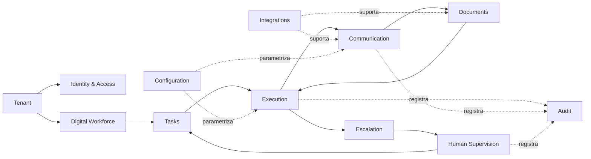

# Arquitetura Funcional do MVP — Servium IA

> **Fase 003 — Arquitetura do MVP e Seleção de Stack** · Etapa A
> Define as capacidades necessárias ao MVP (Assistente Digital de Pendências Documentais), suas responsabilidades, dependências e boundaries — **sem transformá-las em serviços, containers ou bancos**. Uma capacidade não equivale a um deployment.
>
> Base: [`../product/MVP_SCOPE.md`](../product/MVP_SCOPE.md), [`../product/FUNCTIONAL_REQUIREMENTS.md`](../product/FUNCTIONAL_REQUIREMENTS.md), [`../product/NON_FUNCTIONAL_REQUIREMENTS.md`](../product/NON_FUNCTIONAL_REQUIREMENTS.md), [`OPERATIONAL_FLOW.md`](../product/OPERATIONAL_FLOW.md).

## Objetivo

Descrever **o que o sistema faz** (capacidades e responsabilidades) antes de decidir **como ele é construído** (estilo, stack, infraestrutura). Esta separação protege a decisão tecnológica de ser tomada por preferência.

## Contexto

O Servium IA MVP opera para um escritório contábil piloto: mantém checklists documentais por cliente/obrigação, identifica pendências a cada ciclo, cobra clientes finais dentro de limites configurados, recebe e valida documentos, escala exceções a humanos e registra tudo de forma auditável. Um único tipo de Funcionário Digital existe no MVP, modelado como configuração + comportamento, não como código fixo.

## Capacidades

| # | Capacidade | Responsabilidade essencial | FRs/NFRs principais |
|---|---|---|---|
| C1 | **Identity & Access** | Usuários humanos do escritório, autenticação, papéis mínimos | FR-002, NFR-002 |
| C2 | **Tenant** | Identidade do escritório e isolamento lógico de todos os dados | NFR-001 |
| C3 | **Digital Workforce** | Definição/configuração dos Funcionários Digitais (tipo único no MVP): templates, limites de autonomia, checklists, clientes designados | FR-001, FR-003, FR-004 |
| C4 | **Tasks** | Representação do trabalho: ciclos e itens de pendência com estados | FR-005, FR-006, FR-011 |
| C5 | **Execution** | Motor de execução: agendamento, transições de estado, retries seguros, idempotência | FR-007, NFR-008, NFR-017 |
| C6 | **Documents** | Recebimento, metadados, armazenamento referenciado, integridade (hash), vínculo a tarefas | FR-008, FR-009, NFR-010 |
| C7 | **Communication** | Composição de mensagens a partir de templates aprovados, envio via adaptadores de canal, associação de respostas | FR-007, FR-008, NFR-007 |
| C8 | **Human Supervision** | Ativação de ciclos, fila de exceções, aprovações, resoluções registradas, painel de status | FR-005, FR-010, FR-011, FR-012 |
| C9 | **Escalation** | Encaminhamento explícito de situações que não podem continuar automaticamente | FR-010, FR-015 |
| C10 | **Audit** | Registro imutável e reconstrutível de ações relevantes (trilha de negócio) | FR-013, NFR-006, NFR-007 |
| C11 | **Integrations** | Interfaces com serviços externos (canal de comunicação, armazenamento, futuros provedores de IA) | NFR-009, NFR-003 |
| C12 | **Configuration** | Parâmetros operacionais por tenant (`max_attempts`, intervalos, janelas) — configuração, não constante | FR-003 |

## Dependências entre capacidades

Leitura: **Execution é o núcleo orquestrador**; Communication e Documents são seus braços externos; Supervision é o contrapeso humano; Audit observa tudo; Configuration parametriza comportamento.

## Fluxos principais

1. **Configuração (humano):** definir checklist → cadastrar cliente/responsável → aprovar templates → configurar limites;
2. **Ciclo (híbrido):** responsável ativa ciclo → Execution identifica pendentes → Communication envia cobranças dentro dos limites → respostas chegam → Documents valida/classifica → itens resolvem ou escalam;
3. **Exceção (humano decide):** Escalation notifica responsável → revisão com contexto completo → resolução/cancelamento registrado;
4. **Fechamento:** relatório de ciclo gerado e arquivado; métricas extraídas da trilha.

Fluxo detalhado de estados: [`../product/OPERATIONAL_FLOW.md`](../product/OPERATIONAL_FLOW.md).

## Boundaries

Os agrupamentos coerentes de responsabilidades (módulos candidatos) são detalhados em [`DOMAIN_BOUNDARIES.md`](DOMAIN_BOUNDARIES.md). Resumo: Access & Tenancy · Workforce Configuration · Cycle & Task Execution · Documents · Communication · Supervision & Escalation · Audit & Observability.

## Informações compartilhadas

Informações que cruzam boundaries e precisam de ownership claro:

| Informação | Owner | Consumidores |
|---|---|---|
| Identidade do tenant | Access & Tenancy | Todos (obrigatório em toda entidade) |
| Cliente e responsável designado | Workforce Configuration | Execution, Communication, Supervision |
| Estado do item/ciclo | Cycle & Task Execution | Supervision (painel), Audit |
| Documento recebido (metadados + referência) | Documents | Execution, Supervision |
| Template aprovado e limites vigentes | Workforce Configuration | Communication, Execution |
| Evento de auditoria | Audit (append-only) | Relatórios, métricas, supervisão |

Regra: nenhum boundary escreve diretamente nos dados de outro; a interação ocorre por interfaces/eventos definidos.

## Pontos de integração

| Integração | Direção | Abstração |
|---|---|---|
| Canal de comunicação com cliente final (hipótese inicial: e-mail) | Saída + entrada | Port `CommunicationChannel` com adaptadores — ver ADR-008 |
| Armazenamento documental | Saída | Port de storage (object storage compatível S3 proposto) — ADR-007 |
| Provedor de IA/LLM (apenas funções assistivas) | Saída | Port provider-agnóstico — ADR-010 |
| Notificações internas ao escritório | Saída | Mesma abstração de canal, audiência distinta |

O core não depende de provedor específico — apenas das portas.

## Supervisão humana

Pontos formais embutidos na arquitetura (não são features opcionais):

1. ativação de ciclo (gate antes de qualquer contato externo);
2. fila de exceções com contexto completo;
3. aprovação para qualquer ação fora dos limites configurados;
4. revisão de fechamento com pendências críticas;
5. kill switch por cliente e global (capacidade de pausar o Funcionário Digital imediatamente).

## Auditoria

Toda ação relevante gera evento append-only com: tenant, funcionário digital, tarefa/execução, ação, insumos (template, limites vigentes), resultado e evidências. Trilha separada de logs técnicos — ver [`SECURITY_ARCHITECTURE.md`](SECURITY_ARCHITECTURE.md) e drivers ADRV-002.

## Tenant awareness

Toda entidade carrega identidade de tenant desde o primeiro dia; consultas e autorização são contextualizadas por tenant; isolamento lógico verificado por testes. Estratégia de persistência proposta em ADR-005. O piloto single-tenant não autoriza atalhos estruturais.
