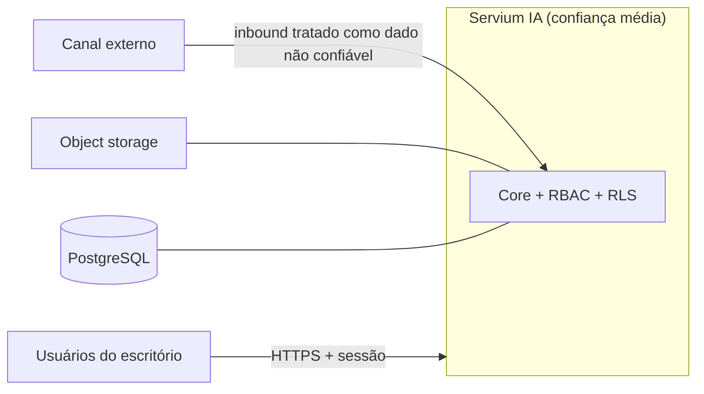

# Security Architecture — Servium IA MVP

> **Fase 003 — Arquitetura do MVP**
> Threat considerations iniciais — enxuto e proporcional ao piloto, não um threat model completo. Base: NFR-001..005, ADRV-001/007/009, RSK-002/003/004/008.

## Ativos a proteger

1. Documentos recebidos de clientes finais (dados pessoais potenciais);
2. Dados cadastrais de clientes do escritório;
3. Trilha de auditoria (integridade);
4. Credenciais de provedores externos (canal, storage);
5. Templates e limites de autonomia (integridade da configuração);
6. Reputação do escritório (mensagens enviadas em seu nome).

## Fronteiras de confiança

- **Usuário autenticado** → confiança por papel, escopo de tenant;
- **Inbound do canal** → conteúdo não confiável (spam, malicioso, prompt injection futuro): tratado como dado, nunca instrução; anexos verificados (tipo/tamanho) antes de aceitos;
- **Provedores externos** → credenciais mínimas, rotacionáveis, fora do código.

## Ameaças principais e controles arquiteturais

| # | Ameaça | Controle arquitetural |
|---|---|---|
| T1 | Vazamento entre tenants | `tenant_id` universal + RLS deny-by-default + testes automatizados de isolamento (ADR-005); URLs de documento sempre mediadas pela aplicação |
| T2 | Acesso indevido a documentos | Autorização contextual em toda leitura; URLs assinadas curtas e escopadas (ADR-007); log de acesso |
| T3 | Credenciais externas expostas | Segredos fora do código, gerenciados pela plataforma; rotação; sem segredos em logs |
| T4 | Prompt injection (futuro LLM) | Conteúdo do cliente = dado, nunca instrução; saída de LLM nunca conclusiva (ADR-010) |
| T5 | Documento malicioso | Verificação básica obrigatória (tipo/tamanho); sem execução de conteúdo; antivírus como evolução registrada |
| T6 | Comunicação enviada incorretamente | Somente templates aprovados; limites verificadas antes do envio; ledger idempotente; kill switch (RSK-002/RSK-008) |
| T7 | Replay/duplicação de tarefas | Chaves de idempotência + outbox conceitual (NFR-008, ADR-006) |
| T8 | Alteração indevida de configuração | Papéis distintos para configuração × operação; toda mudança auditada com autoria |
| T9 | Privilégios excessivos | RBAC mínimo; funcionário digital com permissões declaradas e restritas |
| T10 | Dados pessoais em logs | Sanitização de logs; correlação por IDs, nunca por conteúdo; auditoria guarda evidências estruturadas, não dumps |
| T11 | Sessão comprometida | Sessões httpOnly server-side, expiração, rate limiting no login (ADR-009) |

## Riscos residuais

- Comprometimento total da conta de gestor (mitigado: 2FA como evolução próxima registrada);
- Malware dentro de documento aceito (mitigado parcialmente; antivírus pendente);
- Erro humano em política RLS (mitigado: testes de vazamento no pipeline).

## Assuntos futuros registrados

2FA/TOTP · antivírus/sandbox de anexos · criptografia em nível de aplicativo para documentos ultra-sensíveis · revisão pentest antes de escala comercial · WAF/rate limiting avançado.
