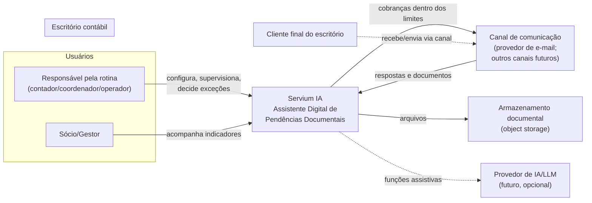

# System Context — Servium IA MVP

> **Fase 003 — Arquitetura do MVP** · Visão inspirada em C4 — nível **System Context**: o Servium IA como um todo, seus usuários e sistemas externos.

## Diagrama

## Atores e sistemas

| Elemento | Tipo | Interação com o Servium IA |
|---|---|---|
| Responsável pela rotina | Pessoa (usuária principal) | Configura checklists/templates/limites; ativa ciclos; trata exceções; acompanha painel |
| Sócio/Gestor | Pessoa | Aprova adoção e limites; acompanha indicadores agregados |
| Cliente final do escritório | Pessoa externa | Não acessa a plataforma; troca mensagens/documentos **via canal de comunicação** |
| Canal de comunicação | Sistema externo | Entrega cobranças; recebe respostas/anexos. Provedor específico ainda a validar (hipótese: e-mail) |
| Armazenamento documental | Sistema externo | Guarda conteúdo dos documentos com integridade e ciclo de vida |
| Provedor de IA/LLM | Sistema externo futuro | Apenas funções assistivas delimitadas ([`AI_USAGE_BOUNDARIES.md`](AI_USAGE_BOUNDARIES.md)); ausência não inviabiliza o MVP |

## Premissas do contexto

- O cliente final **nunca** é usuário direto da plataforma no MVP;
- Nenhum portal governamental ou ERP é integrado nesta fase (Out of Scope);
- O escritório piloto é representado por exatamente um tenant ativo.
